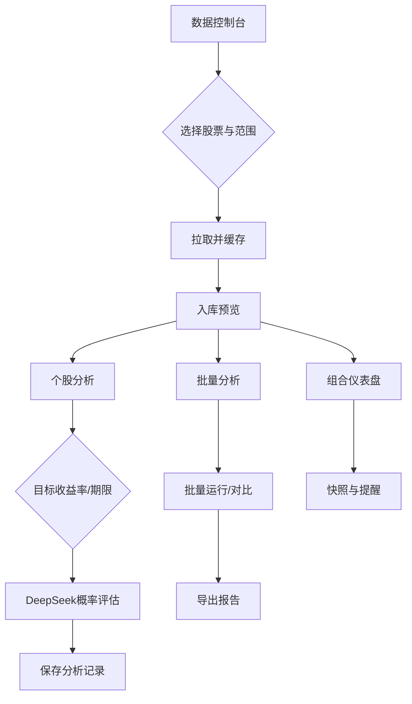

# 组合管理 Agent Web 产品 PRD v0.1

日期：2025-12-28

## 核心价值
以代理为中心的本地投资组合管理 Web 应用：通过 MCP 驱动的 `tushare-mcp` 获取并缓存多年的股票数据到本地数据库（SQLite），并用 DeepSeek 分析 Agent 评估在指定期限达成目标收益率的概率，支持单股与多股批量分析，降低重复拉取成本并提升决策效率。

## 背景分析
- 问题：频繁向 Tushare 拉取数据存在限流与等待；分析过程分散、不可复用；本地研究需要稳定可控的数据副本。
- 机会：MCP 统一协议 + 本地缓存使数据与分析解耦，深度自动化分析可复用；组合视角提升研究与复盘的质量。
- 目标：
  - 降低数据获取成本与等待时间，避免重复调用。
  - 提供可解释的收益达成概率评估（单股/批量）。
  - 支撑组合层的建仓、监控与复盘。
- 技术可行性：`uv tool run tushare-mcp` 已可用；SQLite 适合本地；DeepSeek Agent 用于概率评估与报告生成。

## 用户画像
- Persona A（个人量化爱好者）：本地研究 A 股，需要快速拉取与缓存数据，批量评估目标收益概率，进行中短期策略回测与持仓监控。
- Persona B（小团队研究员）：需要组合视角的风险收益评估、更新快照、跨多只股票的统一分析与报告导出。

## 核心功能列表（MVP / P1）
### P0（MVP，必须有）
- 数据获取与缓存：个股近 5 年（可扩展更多年）财报、交易、估值（PE、PB 等）入库，避免重复拉取。
- 数据更新策略：增量更新（每日/每周）、手动刷新、缺失字段回填；速率与失败重试控制。
- 组合管理：创建/编辑本地组合、添加持仓（数量、买入价、日期、标签）、快照记录。
- 单股概率评估：以当前价格买入，给定目标收益率和期限，输出达成概率与区间分布。
- 多股批量评估：同参数批量运行，比较各股概率、排序与筛选。
- 可视化与报告：价格历史、估值时序、概率分布图、关键结论摘要；导出 CSV/Markdown。
- 价值分析辅助：内置常见价值方法的输入与提示校验（DCF、周期股简化模型、唐书房估值框架），输出“常识性判断”标签以对比概率结果。

### P1（后续增强，Nice to have）
- 因子与风险：波动率、β、估值分位、财务健康评分、简单因子暴露。
- 场景模拟与蒙特卡洛：多情景（乐观/基准/悲观）与自定义波动率/漂移。
- 组合层目标达成概率：考虑权重、相关性近似，估算组合整体收益目标概率。
- 策略与回测：简单规则（估值分位筛选、动量筛选）与滚动回测。
- 警报与刷新任务：数据陈旧提醒、突破阈值推送（本地通知/邮件）。
- 研报生成：自动生成分析摘要与决策备忘。
- 价值分析助手：
  - DCF 向导（自由现金流、增长率、折现率、永续增长假设）与敏感性分析。
  - 周期股估值面板（盈利周期位置、均值回归假设、现金流稳定性提示）。
  - 唐书房估值框架（高分红稳健股估值、消费/金融/周期的分档参考）。

## 交互流程（User Flow）
- 流程 1：拉取并缓存个股数据（首次/增量）
  - 进入“数据控制台” → 输入股票代码/选择列表 → 选择范围（默认 5 年，可扩展）与数据类型（财报/交易/估值） → 点击“拉取并缓存” → 后台任务执行（进度条、日志） → 完成后入库并可预览。
- 流程 2：单股概率评估
  - 打开“个股分析” → 选择股票 → 输入目标收益率（如 10%）、期限（如 12 个月） → 选择分析方法（历史/GBM/混合） → 运行 DeepSeek Agent → 展示概率、分布图、关键驱动因素与解释 → 保存分析记录。
- 流程 3：多股批量评估
  - 打开“批量分析” → 选择多只股票（可从组合选取） → 统一参数（收益率、期限、方法） → 运行 → 展示表格对比（概率、分位、排序） → 导出。
- 流程 4：组合概览与快照
  - 打开“组合仪表盘” → 查看总资产、当日盈亏、估值区间分布、最近分析摘要 → 创建/更新快照 → 对异常项（数据陈旧/缺失）给出修复入口。



## 关键界面描述（Key Screens）
- 数据控制台（Header / Body / Footer）
  - Header：页面标题“数据控制台”、全局搜索框、设置入口（速率限制、Token）。
  - Body：左侧股票选择（代码、名称、标签、收藏）；右侧参数区（时间范围：5 年默认，可选 10 年；数据类型：财报/交易/估值）；拉取进度与日志视图；缓存命中率显示。
  - Footer：操作按钮（“拉取并缓存”、“仅增量刷新”）、上次更新时间与失败重试入口。
- 个股分析
  - Header：股票信息（名称、代码、当前价、PE/PB、最近财报日期）。
  - Body：参数卡片（目标收益率%、期限、方法选择）；结果视图（概率指标、区间分布图、历史对照、解释）；数据源标注（本地缓存/更新时间）。
  - Footer：“保存分析记录”、“导出 CSV/MD”、“添加到报告”。
- 批量分析
  - Header：批量选择器（多选、从组合导入、行业过滤）。
  - Body：参数卡片（统一参数）；结果表格（股票、概率、排序、估值分位、波动率）；可视化（箱线图/柱状图）。
  - Footer：“批量保存分析”、“导出”、“创建组合建议”。
- 组合仪表盘
  - Header：组合选择器、总资产与当日盈亏。
  - Body：模块化卡片（持仓列表、估值分布、最近分析摘要、数据健康度、任务队列状态）。
  - Footer：“创建快照”、“一键增量刷新”、“报警设置”。

## 分析方法与数学模型（Agent 提示规范）
- 输入：当前价 $S_0$，目标收益率 $R$，期限 $T$（年或月），历史价格序列，估值与财务要素（可选）。
- 方法 A：历史重采样（Bootstrap）
  - 估计历史对数收益分布，模拟 $N$ 次路径，计算 $P\left(\frac{S_T}{S_0} \ge 1+R\right)$。
- 方法 B：几何布朗运动（GBM）
  - 估计漂移 $\mu$ 与波动率 $\sigma$（历史均值与标准差或回归）。
  - $$\ln\left(\frac{S_T}{S_0}\right) \sim \mathcal{N}\left((\mu - \tfrac{1}{2}\sigma^2)T,\ \sigma^2 T\right)$$
  - 概率：$$P = 1 - \Phi\left(\frac{\ln(1+R) - (\mu - \tfrac{1}{2}\sigma^2)T}{\sigma\sqrt{T}}\right)$$
- 输出：概率值、置信区间、敏感性（对 $\mu,\sigma$）、解释性文案（主要驱动因素与风险）。

## 价值投资分析方法增强（与概率分析的常识性交叉校验）
- DCF（贴现现金流）
  - 关键输入：自由现金流 $FCF_0$，未来 $n$ 年增长率 $g_n$，折现率 $r$，永续增长率 $g_{\infty}$，净债务。
  - 企业价值：$$EV = \sum_{t=1}^{n} \frac{FCF_0 \times \prod_{k=1}^{t}(1+g_k)}{(1+r)^t} + \frac{FCF_n \times (1+g_{\infty})}{(r - g_{\infty})(1+r)^n}$$
  - 股权价值：$Equity = EV - NetDebt$；目标每股内在价值 = $Equity / Shares$。
  - 常识校验：
    - 如果折现率 < 无风险利率或永续增长 > GDP 增速，标记“假设过乐观”。
    - 近三年现金流波动 > 阈值时提示“现金流不稳定，应扩展情景”。

- 周期股简化模型（格雷厄姆/常识约束）
  - 使用 5-10 年盈利均值或周期底部盈利，做均值回归假设：$E_{norm} = \text{mean}(E_{5-10y})$。
  - 估值：$Value \approx E_{norm} \times PE_{mid}$，其中 $PE_{mid}$ 取行业中位或安全边际下修。
  - 常识校验：
    - 盈利标准差/均值 > 阈值时，提示“高度周期性，需保守 PE”。
    - 资产负债率上行且行业下行期，提示“谨慎：周期底未确认”。

- 唐书房估值框架（高分红稳健股为例，可扩展行业分档）
  - 指标侧重：股息率、分红稳定度（近 3-5 年分红比率方差）、估值分位（PE/PB）、现金流覆盖率。
  - 粗分档示例（需结合行业调优）：
    - 分红稳定且估值分位 < 30% → “安全边际高”；
    - 分红稳定但估值中性 → “等待更优价”；
    - 分红不稳定且估值高 → “风险高”。
  - 常识校验：若分红覆盖率 < 1 且仍高分红，标记“分红可持续性存疑”。

- 概率分析与价值分析的交叉逻辑
  - 如果概率模型给出高概率达成收益，但价值模型提示“估值已偏高/假设乐观”，显示“概率结果需谨慎，估值安全边际不足”。
  - 如果概率低但价值模型给出“安全边际高”，提示“或可逢低建仓/分批买入”，并建议放宽收益率或拉长期限重算概率。
  - 报告中输出“常识性判断”标签：乐观/中性/保守，并列出触发原因（折现率、分红稳定度、估值分位、周期性波动）。

## 技术架构（本地 Web + MCP）
- 前端：轻量 Web（React/Next.js 或 SvelteKit），组件化，支持进度显示与本地状态。
- 后端：Python（FastAPI），MCP 客户端调用 `tushare-mcp` 与 DeepSeek Agent；任务调度（`apscheduler` 或后台任务）。
- 数据库：SQLite（本地文件），ORM（SQLAlchemy）。

### 数据模型（SQLite 表）
- stocks(id, ts_code, name, sector, active)
- price_history(id, ts_code, trade_date, close, open, high, low, volume)
- financials(id, ts_code, period, revenue, profit, roe, roa, debt_ratio, …)
- valuations(id, ts_code, date, pe, pb, ps, ev_ebitda, …)
- portfolios(id, name, created_at)
- holdings(id, portfolio_id, ts_code, qty, buy_price, buy_date, tags)
- analyses(id, ts_code, method, target_return, horizon, probability, params_json, created_at)
- jobs(id, type, status, progress, started_at, finished_at, logs)

### 集成
- Tushare MCP：通过 MCP 客户端发起标准化请求；工具路由到 `uv tool run tushare-mcp` 服务。
- DeepSeek Agent：统一的 Agent 接口（HTTP/SDK），后端封装提示模版与容错重试。

### 缓存与增量策略
- 读优先本地缓存；按数据类型设置 TTL（交易：日更；财报：季度更；估值：日/周更）。
- 增量更新：根据最后更新日期拉取缺口区间；失败重试与指数退避。
- 入库去重：基于 `ts_code + date/period` 唯一键。

### 任务与速率控制
- 并发上限（防限流），分片拉取，日志与可视化进度。
- 失败分类（网络/限流/字段缺失），提供重跑按钮。

## 用户旅程图（User Journey）
- 入门：配置 Token → 选择股票 → 一键拉取 → 组合建仓。
- 分析：单股参数 → 运行 Agent → 查看概率与解释 → 保存记录。
- 扩展：批量分析 → 排序筛选 → 生成建议 → 更新组合与快照。
- 复盘：查看历史快照与报告 → 对比概率与实际收益 → 迭代策略。

## 实用附加功能建议
- 数据健康度与校验：字段缺失检测与修复建议。
- 快照与版本：时间点冻结数据与分析，便于复盘。
- 标签与笔记：为持仓和分析添加研究标签与结论。
- 导出与共享：CSV/Markdown 报告导出，方便归档。
- 简易因子面板：估值分位、动量、波动率等一页看齐。
- 本地备份与恢复：SQLite 文件备份与还原。

## 配置与运行（草案）
- 环境变量：`TUSHARE_TOKEN`, `DEEPSEEK_API_KEY`。
- 启动数据源（已安装）：

```bash
uv tool run tushare-mcp
```

- 后端服务栈示例：FastAPI + SQLAlchemy + apscheduler；前端以 Next.js/SvelteKit。
- 后续：生成后端 API 规范与最小运行骨架（含 SQLite schema、MCP/DeepSeek 调用封装、示例前端页）。

## 逻辑与设计理由
- 本地缓存减少重复拉取与等待，契合研究工作流。
- MCP 让数据源/Agent 解耦，便于替换与扩展。
- 概率评估提供可解释的决策指标；多方法交叉提高稳健性。
- UI 以任务与组合为主线，突出可操作性与结果。

## 路线图（Roadmap）
- 里程碑 1（MVP）：数据缓存与增量刷新、个股/批量概率评估、组合管理、基本可视化与导出。
- 里程碑 2：因子与风险面板、场景模拟与蒙特卡洛、报警与任务调度。
- 里程碑 3：组合层概率、回测模块、研报生成与快照体系完善。

## 假设与澄清（已确认）
- 市场范围：覆盖中国 A 股、港股与 ETF；`TUSHARE_TOKEN` 已配置。
- 数据覆盖：仅处理活跃股票（不含退市），行业无限定。
- DeepSeek：API Key 已配置，不考虑成本与延迟限制。
- 后台任务：允许运行本地调度并保存历史快照。
- 隐私：单用户本地使用，无需登录/认证。


